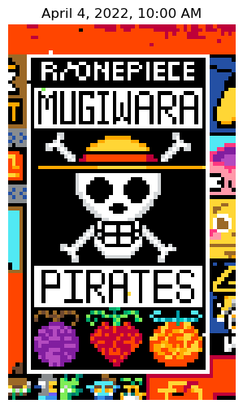
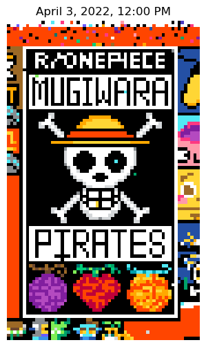
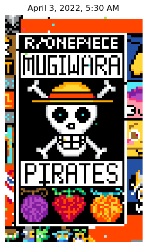

This notebook analyzes the most placed coordinates in the r/place 2022 dataset. Using the five whys methodology we seek to explain why these coordinates were the most interacted with. 


```python

import duckdb
import pandas as pd
import matplotlib.pyplot as plt
import numpy as np
```


```python

parquet_file = "E:\\Downloads\\2022_place_canvas_history_week_3.parquet"
new_parquet_file = "E:\\Downloads\\2022_place_canvas_history_week_4.parquet"
```


```python

con = duckdb.connect()

query = f"""
    COPY (
        SELECT 
            timestamp,
            pixel_color,
            CAST(SPLIT_PART(coordinate, ',', 1) AS INTEGER) AS x,
            CAST(SPLIT_PART(coordinate, ',', 2) AS INTEGER) AS y
        FROM 
            '{parquet_file}'
    ) TO '{new_parquet_file}' (FORMAT 'parquet', COMPRESSION 'zstd', ROW_GROUP_SIZE 5000000);
"""

con.execute(query)
con.close()

print("complete")
```


    FloatProgress(value=0.0, layout=Layout(width='auto'), style=ProgressStyle(bar_color='black'))


    complete
    


```python

con = duckdb.connect()

most_placed = f"""
    SELECT
        x,
        y,
        COUNT(*) AS count
    FROM 
        '{new_parquet_file}'
    GROUP BY 
        x, 
        y
    ORDER BY 
        count DESC
    LIMIT 3;
"""

results = con.execute(most_placed).fetchall()

for row in results:
    print(row)

con.close()
```


    FloatProgress(value=0.0, layout=Layout(width='auto'), style=ProgressStyle(bar_color='black'))


    (0, 0, 98807)
    (359, 564, 69198)
    (349, 564, 55230)
    


```python

timestamp1 = "2022-04-04 10:00:00"  
timestamp2 = "2022-04-03 12:00:00"  
timestamp3 = "2022-04-03 05:30:00"

```


```python

def get_snapshot(timestamp):
    con = duckdb.connect()
    
    query = f"""
        SELECT 
            x,
            y, 
            pixel_color
        FROM 
            '{new_parquet_file}'
        WHERE 
            timestamp <= '{timestamp}'
            AND x BETWEEN {x_min} AND {x_max}
            AND y BETWEEN {y_min} AND {y_max}
        QUALIFY ROW_NUMBER() OVER (PARTITION BY x, y ORDER BY timestamp DESC) = 1;
    """
    

    return con.execute(query).df()

```


```python

color_map = {
    "#6D001A": (109, 0, 26), "#BE0039": (190, 0, 57), "#FF4500": (255, 69, 0),
    "#FFA800": (255, 168, 0), "#FFD635": (255, 214, 53), "#FFF8B8": (255, 248, 184),
    "#00A368": (0, 163, 104), "#00CC78": (0, 204, 120), "#7EED56": (126, 237, 86),
    "#00756F": (0, 117, 111), "#009EAA": (0, 158, 170), "#00CCC0": (0, 204, 192),
    "#2450A4": (36, 80, 164), "#3690EA": (54, 144, 234), "#51E9F4": (81, 233, 244),
    "#493AC1": (73, 58, 193), "#6A5CFF": (106, 92, 255), "#94B3FF": (148, 179, 255),
    "#811E9F": (129, 30, 159), "#B44AC0": (180, 74, 192), "#E4ABFF": (228, 171, 255),
    "#DE107F": (222, 16, 127), "#FF3881": (255, 56, 129), "#FF99AA": (255, 153, 170),
    "#6D482F": (109, 72, 47), "#9C6926": (156, 105, 38), "#FFB470": (255, 180, 112),
    "#000000": (0, 0, 0), "#515252": (81, 82, 82), "#898D90": (137, 141, 144),
    "#D4D7D9": (212, 215, 217), "#FFFFFF": (255, 255, 255)
}


```


```python
def plot_snapshot(df, title):

    width, height = x_max - x_min + 1, y_max - y_min + 1

    img = np.ones((height, width, 3), dtype=np.uint8) * 255

    for _, row in df.iterrows():
        x, y, color = row["x"], row["y"], row["pixel_color"]
        img[y - y_min, x - x_min] = color_map.get(color, (0, 0, 0))  # Default to black if color not found

    
    plt.figure(figsize=(6, 6))
    plt.imshow(img)
    plt.title(title)
    plt.axis("off")
    plt.show()
```


```python
#area one: (0,0)
x_min, y_min, x_max, y_max = 0, 0, 250, 40

area_one_snapshot1 = get_snapshot(timestamp1)

con.close()
```


    FloatProgress(value=0.0, layout=Layout(width='auto'), style=ProgressStyle(bar_color='black'))


```python
plot_snapshot(area_one_snapshot1, "April 4, 2022, 10:00 AM")

```


    

    


Why is the coordinate (0, 0) the most placed coordinate?
    Because it is the corner of the canvas.
    
Why does being the corner make it so popular? 
    Because the corners are highly contested areas for artwork.
    
Why do people fight over the corner of the canvas?
    Because the corners are one of the most viewed places on r/place
    
why do people want their artwork in the most viewed place?
    Because being viewed brings attention to the underlying community that the artwork was created for
    
why is bringing attention to a certain community important?
    Because gaining attention brings a sense of pride and unity to the community increasing their presence on the internet. Additionally it solidifies their place in the history of r/place. 


```python
#area tw0: (359, 564) and (349, 564)
x_min, y_min, x_max, y_max = 325, 520, 385, 620

area_two_snapshot1 = get_snapshot(timestamp1)
area_two_snapshot2 = get_snapshot(timestamp2)
area_two_snapshot3 = get_snapshot(timestamp3)

con.close()
```


    FloatProgress(value=0.0, layout=Layout(width='auto'), style=ProgressStyle(bar_color='black'))


    FloatProgress(value=0.0, layout=Layout(width='auto'), style=ProgressStyle(bar_color='black'))


    FloatProgress(value=0.0, layout=Layout(width='auto'), style=ProgressStyle(bar_color='black'))


```python
plot_snapshot(area_two_snapshot1, "April 4, 2022, 10:00 AM")
```


    

    


```python
plot_snapshot(area_two_snapshot2, "April 3, 2022, 12:00 PM")
```


    

    


```python
plot_snapshot(area_two_snapshot3, "April 3, 2022, 5:30 AM")
```


    

    


Why are the coordinates (359, 564) and (349, 564) placed so often?
    Because they represent the eyes of the straw hat pirates skull from the anime One Piece.
    
Why do people change the eyes of the skull?
    Because by changing the eyes changes the entire characters indentity. In this case by changing the eyes from fully black to including a cyan/blue dot, the artwork now represents Sans, a skelton character with blue eyes from a game called UnderTale.
    
Why do people want to change the identity of the artwork?
    Because r/place is about expanding and taking over artwork representing one community and have it represent another community.
    
Why didn't people fully replace the onepiece art with an artpiece fully dedicated to Sans?
    Because to take over an artpiece you need more people deicated to changing an artpiece than protecting one.
    
Why were more people protecting the art piece than trying to change it?
    Because One Piece is one of the most popular anime shows with a very large fanbase. Where as UnderTale is a smaller indie video game with a samller community. Because of this, the undertale community focused on simply 2 pixels rather than trying to controll hundreds. 
